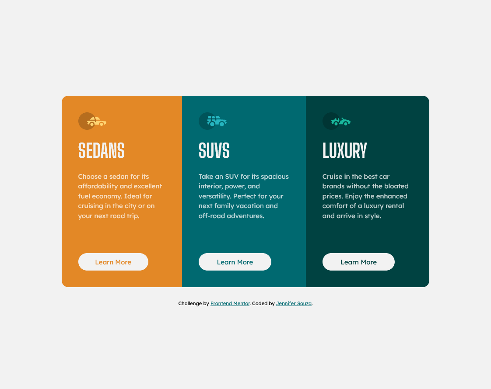

# Frontend Mentor - 3-column preview card component solution

This is a solution to the [3-column preview card component challenge on Frontend Mentor](https://www.frontendmentor.io/challenges/3column-preview-card-component-pH92eAR2-). Frontend Mentor challenges help you improve your coding skills by building realistic projects.

## Table of contents

- [Overview](#overview)
  - [The challenge](#the-challenge)
  - [Screenshot](#screenshot)
  - [Links](#links)
- [My process](#my-process)
  - [Built with](#built-with)
  - [What I learned](#what-i-learned)
  - [Continued development](#continued-development)
- [Author](#author)

## Overview

Mobile-first responsive three-column card component using css flexbox.

### The challenge

Users should be able to:

- View the optimal layout depending on their device's screen size
- See hover states for interactive elements

### Screenshot

### Links

- Solution URL: [https://github.com/zoedarkweather/zoedarkweather.github.io](https://github.com/zoedarkweather/zoedarkweather.github.io)
- Live Site URL: [https://zoedarkweather.github.io/](https://zoedarkweather.github.io/)

## My process

### Built with

- CSS custom properties
- CSS Flexbox
- Mobile-first workflow

### What I learned

This was an opportunity to practice CSS, in particular flexbox and using rem and em units.  

### Continued development

Keep practicing css. Keep practicing using rem and em units until it gets more intuitive for me.

## Author

- Github: [Jennifer Souza](https://github.com/zoedarkweather)
- Frontend Mentor: [@zoedarkweather](https://www.frontendmentor.io/profile/zoedarkweather)
